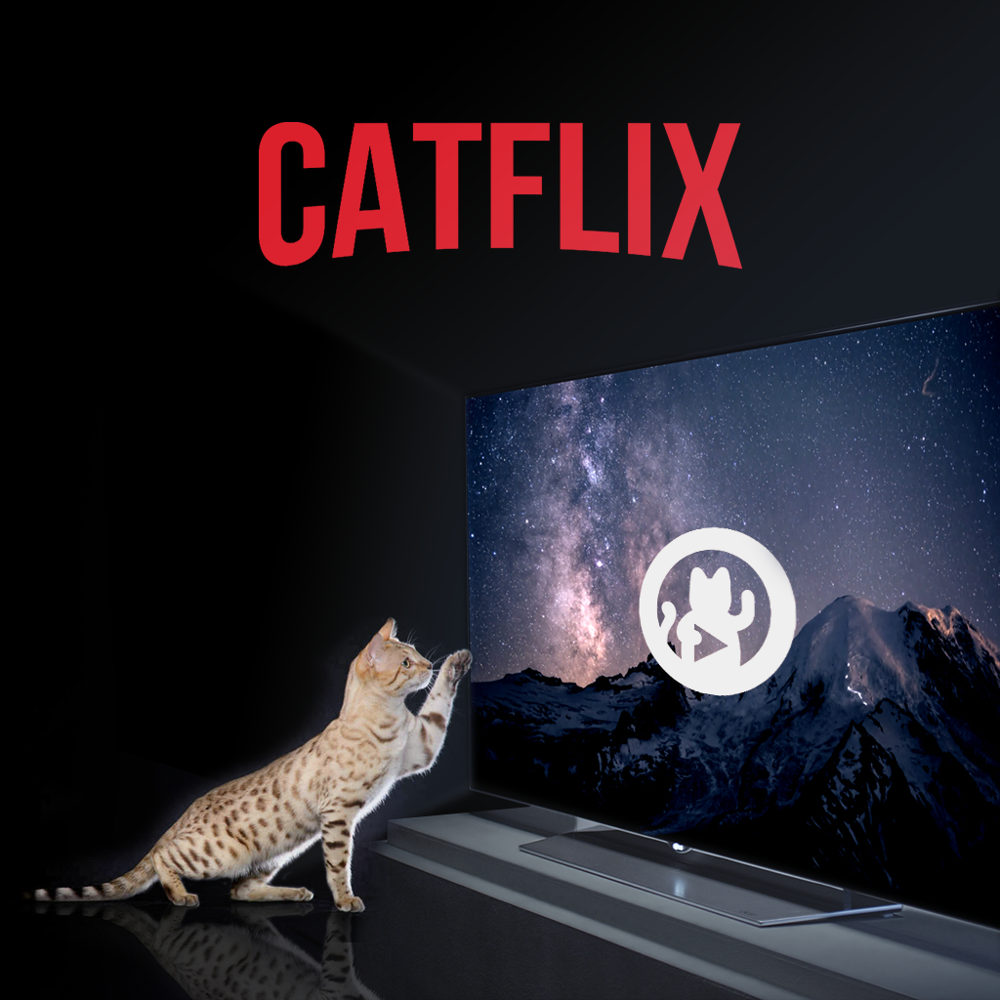

<p align="center">
	
</p>

`catflix` is a [chaosflix](https://github.com/NiciDieNase/chaosflix) inspired LG webOS client app for your daily [media.ccc.de](https://media.ccc.de) dose. Enjoy the pleasant comfort of binge watching through your favourite congress talks from your couch on your big flatscreen.

## Quickstart

The application has yet to be pushed to the `LG Content Store`.

In the future, you can install `catflix` via your `LG Content Store` app on your LG TV.

## Development
```sh
git clone https://github.com/technokrat-llc/catflix.git
cd catflix
```

Use the [webOS IDE](http://webostv.developer.lge.com/sdk/tools/ide/) to push the application to your LG TV. You also have to turn the developer mode on (see [LG's documentation](http://webostv.developer.lge.com/develop/app-test/#turningDeveloperModeOn)).

The sources need to be transpiled first to the dist folder, so our webOS can parse the ES6 sources correctly. Install the latest [Node.js](https://nodejs.org/en/) and run the following inside the cloned repository:

```sh
npm install
npm run build
```

Then push the application via the IDE onto your TV.